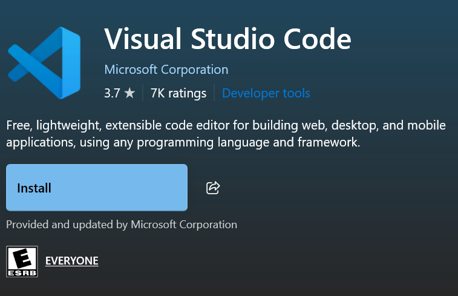
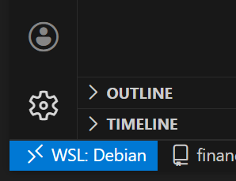

I want to use VSCode for the most part to do all of my Linux based coding. I can do some Windows coding from it too. But I think at a certain level I made need to use something more powerful like Visual Studio to do heavier Windows based programming.

You can get VSCode from the Microsoft store:
[]([https://apps.microsoft.com/detail/9MSVKQC78PK6?hl=en-us&gl=US&ocid=pdpshare](https://apps.microsoft.com/detail/9MSVKQC78PK6?hl=en-us&gl=US&ocid=pdpshare))

# Setting up WSL with VSCode

See [WSL Configuration](WSL%20Configuration.md) to set up WSL.

Once VSCode and WSL are installed and working, setup WSL to be the default terminal that opens with ```CTRL + SHIFT + ` ```. I totally forget how I did this. 

Navigate to any directory within WSL from the terminal, and try to open a file with ```code -r filename``` and you will be prompted to install ```wget``` in order to install ```vscode-server```, which allows Windows to treat anything in WSL like a remote host. Proceed to do this.

When connecting to anything on WSL, you should see this in the bottom left corner of VSCode:




